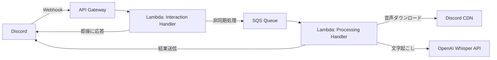

# Discord Voice Message Transcription Bot

Discord の音声メッセージを自動で文字起こしする Bot です。OpenAI Whisper API を使用し、AWS Lambda 上で動作します。

## 🎯 特徴

- Discord の音声メッセージを自動検出
- OpenAI Whisper API による高精度な日本語文字起こし
- AWS Lambda によるサーバーレス構成
- コスト効率的な運用（月額約 $15）

## 🛠️ 技術スタック

- **言語**: Python 3.11
- **Discord ライブラリ**: discord.py 2.5+
- **音声認識**: OpenAI Whisper API
- **インフラ**: AWS Lambda + API Gateway
- **IaC**: AWS CDK v2 (Python)
- **パッケージ管理**: uv

## 📋 必要な環境

- Python 3.11+
- AWS アカウント
- AWS CLI 設定済み
- AWS CDK CLI (`npm install -g aws-cdk`)
- Discord Developer アカウント
- OpenAI API キー

## 🚀 セットアップ

### 1. リポジトリのクローン

```bash
git clone https://github.com/tqer39/discord-voice-message-transcription-bot.git
cd discord-voice-message-transcription-bot
```

### 2. 依存関係のインストール

```bash
# Bot の依存関係
uv venv
source .venv/bin/activate  # Windows: .venv\Scripts\activate
uv pip install -e ".[dev,cdk]"

# Lambda Layer 用の依存関係を準備
mkdir -p layers/dependencies/python
pip install -r requirements.txt -t layers/dependencies/python/
```

### 3. AWS Systems Manager Parameter Store に秘密情報を設定

```bash
# Discord Bot Token を設定
aws ssm put-parameter \
    --name "/discord-bot/discord-token" \
    --value "YOUR_DISCORD_BOT_TOKEN" \
    --type "SecureString"

# OpenAI API Key を設定
aws ssm put-parameter \
    --name "/discord-bot/openai-api-key" \
    --value "YOUR_OPENAI_API_KEY" \
    --type "SecureString"
```

### 4. Discord Bot の作成

1. [Discord Developer Portal](https://discord.com/developers/applications) で新しいアプリケーションを作成
2. Bot セクションでトークンを取得
3. 必要な権限を設定（Send Messages, Read Message History, Attach Files）
4. OAuth2 > URL Generator で Bot を選択し、必要な権限をチェック
5. 生成された URL で Bot をサーバーに招待

### 5. AWS へのデプロイ (CDK)

```bash
# CDK のブートストラップ (初回のみ)
cdk bootstrap

# デプロイ
cdk deploy

# デプロイ後、出力される API エンドポイントを Discord アプリケーションに設定
# Discord Developer Portal > Your App > General Information > Interactions Endpoint URL
```

## 🎮 使い方

1. Bot を Discord サーバーに招待
2. 音声メッセージを送信
3. Bot が自動的に文字起こし結果を返信

## 📂 プロジェクト構造

```
discord-voice-message-transcription-bot/
├── cdk/                     # AWS CDK インフラストラクチャコード
│   ├── app.py
│   └── stacks/
│       └── discord_bot_stack.py
├── src/
│   ├── bot/
│   │   ├── __init__.py
│   │   ├── discord_client.py
│   │   └── handlers.py
│   ├── transcription/
│   │   ├── __init__.py
│   │   └── whisper_client.py
│   └── lambda_handlers/
│       ├── interaction_handler.py  # Discord インタラクション処理
│       └── processing_handler.py   # 音声処理（非同期）
├── layers/
│   └── dependencies/        # Lambda Layer 用の依存関係
├── tests/
├── .env.example
├── .gitignore
├── README.md
├── pyproject.toml
├── requirements.txt
└── cdk.json
```

## 🏗️ アーキテクチャ



## 💰 コスト見積もり

1日100回の使用を想定：
- OpenAI Whisper API: 約 $13.50/月
- AWS Lambda: 約 $0.50/月
- API Gateway: 約 $0.10/月
- SQS: 約 $0.01/月
- **合計: 約 $14-15/月**

## 🔧 開発

### ローカルでのテスト

```bash
# ユニットテストの実行
pytest

# コードフォーマット
black src/ tests/
ruff check src/ tests/

# 型チェック
mypy src/
```

### CDK の操作

```bash
# 変更内容の確認
cdk diff

# スタックの削除
cdk destroy
```

## 🤝 コントリビューション

Issue や Pull Request を歓迎します！

## 📄 ライセンス

MIT License

## 👤 作者

- **Takeru O'oyama** - [@tqer39](https://github.com/tqer39)

## 🔗 関連リンク

- [Discord Developer Documentation](https://discord.com/developers/docs)
- [OpenAI Whisper API](https://platform.openai.com/docs/guides/speech-to-text)
- [AWS Lambda Documentation](https://docs.aws.amazon.com/lambda/)
- [AWS CDK Documentation](https://docs.aws.amazon.com/cdk/v2/guide/)
